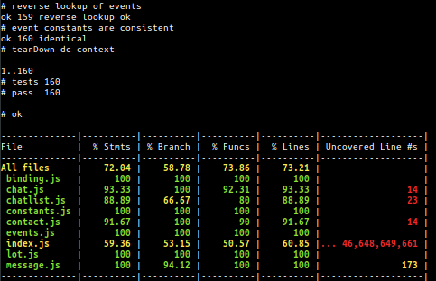

# deltachat-node

> node.js bindings for [`deltachat-core-rust`][deltachat-core-rust]

[](https://www.npmjs.com/package/deltachat-node)

[](https://coveralls.io/github/deltachat/deltachat-node)
[](https://david-dm.org/deltachat/deltachat-node)
[](https://prettier.io)

**If you are upgrading:** please see [`UPGRADING.md`](UPGRADING.md).

`deltachat-node` primarily aims to offer two things:

- A high level JavaScript api with syntactic sugar
- A low level c binding api around  [`deltachat-core-rust`][deltachat-core-rust]

## Table of Contents

<details><summary>Click to expand</summary>

- [Install](#install)
- [Dependencies](#dependencies)
- [Build from source](#build-from-source)
- [Usage](#usage)
- [Developing](#developing)
- [License](#license)

</details>

## Install

By default the installation will build try to use the bundled prebuilds in the
npm package. If this fails it falls back to compile the bundled
`deltachat-core-rust` from the submodule using `scripts/rebuild-core.js`.
To install from npm use:

```
npm install deltchat-node
```

## Dependencies

- Nodejs >= `v16.0.0`
- rustup (optional if you can't use the prebuilds)

> On Windows, you may need to also install **Perl** to be able to compile deltachat-core.

## Build from source

If you want to build from source, make sure that you have `rustup` installed.
You can either use `npm install deltachat-node --build-from-source` to force
building from source or clone this repository and follow this steps:

1. `git clone https://github.com/deltachat/deltachat-node.git`
2. `cd deltachat-node`
3. `npm i`

### Workaround to build for x86_64 on Apple's M1

deltachat doesn't support universal (fat) binaries (that contain builds for both cpu architectures) yet, until it does you can use the following workaround to get x86_64 builds:

```
$ fnm install 17 --arch x64
$ fnm use 17
$ node -p process.arch
# result should be x64
$ cd deltachat-core-rust && rustup target add x86_64-apple-darwin && cd -
$ git apply patches/m1_build_use_x86_64.patch
$ CARGO_BUILD_TARGET=x86_64-apple-darwin npm run build
$ npm run test
```

(when using [fnm](https://github.com/Schniz/fnm) instead of nvm, you can select the architecture)
If your node and electron are already build for arm64 you can also try bulding for arm:

```
$ fnm install 16 --arch arm64
$ fnm use 16
$ node -p process.arch
# result should be arm64
$ npm_config_arch=arm64 npm run build
$ npm run test
```

## Usage

```js
const { Context } = require('deltachat-node')

const opts = {
  addr: '[email]',
  mail_pw: '[password]',
}

const contact = '[email]'

async function main() {
  const dc = Context.open('./')
  dc.on('ALL', console.log.bind(null, 'core |'))

  try {
    await dc.configure(opts)
  } catch (err) {
    console.error('Failed to configure because of: ', err)
    dc.unref()
    return
  }

  dc.startIO()
  console.log('fully configured')

  const contactId = dc.createContact('Test', contact)
  const chatId = dc.createChatByContactId(contactId)
  dc.sendMessage(chatId, 'Hi!')

  console.log('sent message')

  dc.once('DC_EVENT_SMTP_MESSAGE_SENT', async () => {
    console.log('Message sent, shutting down...')
    dc.stopIO()
    console.log('stopped io')
    dc.unref()
  })
}

main()
```
this example can also be found in the examples folder [examples/send_message.js](./examples/send_message.js)

### Generating Docs

We are curently migrating to automaticaly generated documentation.
You can find the old documentation at [old_docs](./old_docs).

to generate the documentation, run:

```
npx typedoc
```

The resulting documentation can be found in the `docs/` folder.
An online version can be found under [js.delta.chat](https://js.delta.chat).

## Developing

### Tests and Coverage

Running `npm test` ends with showing a code coverage report, which is produced by [`nyc`](https://github.com/istanbuljs/nyc#readme).



The coverage report from `nyc` in the console is rather limited. To get a more detailed coverage report you can run `npm run coverage-html-report`. This will produce a html report from the `nyc` data and display it in a browser on your local machine.

To run the integration tests you need to set the `DCC_NEW_TMP_EMAIL` environment variables. E.g.:

```
$ export DCC_NEW_TMP_EMAIL=https://testrun.org/new_email?t=[token]
$ npm run test
```

### Scripts

We have the following scripts for building, testing and coverage:

- `npm run coverage` Creates a coverage report and passes it to `coveralls`. Only done by `Travis`.
- `npm run coverage-html-report` Generates a html report from the coverage data and opens it in a browser on the local machine.
- `npm run generate-constants` Generates `constants.js` and `events.js` based on the `deltachat-core-rust/deltachat-ffi/deltachat.h` header file.
- `npm install` After dependencies are installed, runs `node-gyp-build` to see if the native code needs to be rebuilt.
- `npm run build` Rebuilds all code.
- `npm run build:core` Rebuilds code in `deltachat-core-rust`.
- `npm run build:bindings` Rebuilds the bindings and links with `deltachat-core-rust`.
- `ǹpm run clean` Removes all built code
- `npm run prebuildify` Builds prebuilt binary to `prebuilds/$PLATFORM-$ARCH`. Copies `deltachat.dll` from `deltachat-core-rust` for windows.
- `npm run download-prebuilds` Downloads all prebuilt binaries from github before `npm publish`.
- `npm run submodule` Updates the `deltachat-core-rust` submodule.
- `npm test` Runs `standard` and then the tests in `test/index.js`.
- `npm run test-integration` Runs the integration tests.
- `npm run hallmark` Runs `hallmark` on all markdown files.

### Releases

The following steps are needed to make a release:

1. Update `CHANGELOG.md` (and run `npm run hallmark` to adjust markdown)

- Add release changelog in top section
- Also adjust links to github prepare links at the end of the file

2. Bump version number in package.json
3. Commit the changed files, commit message should be similiar to `Prepare for v1.0.0-foo.number`
4. Tag the release with `git tag -a v1.0.0-foo.number`
5. Push to github with `git push origin master --tags`
6. Wait until `Make Package` github action is completed
7. Download `deltachat-node.tgz` from the github release and run `npm publish deltachat-node.tgz` to publish it to npm. You probably need write rights to npm.

## License

Licensed under `GPL-3.0-or-later`, see [LICENSE](./LICENSE) file for details.

>    Copyright © 2018 `DeltaChat` contributors.
>
>    This program is free software: you can redistribute it and/or modify
>    it under the terms of the GNU General Public License as published by
>    the Free Software Foundation, either version 3 of the License, or
>    (at your option) any later version.
>
>    This program is distributed in the hope that it will be useful,
>    but WITHOUT ANY WARRANTY; without even the implied warranty of
>    MERCHANTABILITY or FITNESS FOR A PARTICULAR PURPOSE.  See the
>    GNU General Public License for more details.
>
>    You should have received a copy of the GNU General Public License
>    along with this program.  If not, see <http://www.gnu.org/licenses/>.

[deltachat-core-rust]: https://github.com/deltachat/deltachat-core-rust

[appveyor-shield]: https://ci.appveyor.com/api/projects/status/t0narp672wpbl6pd?svg=true

[appveyor]: https://ci.appveyor.com/project/ralphtheninja/deltachat-node-d4bf8
